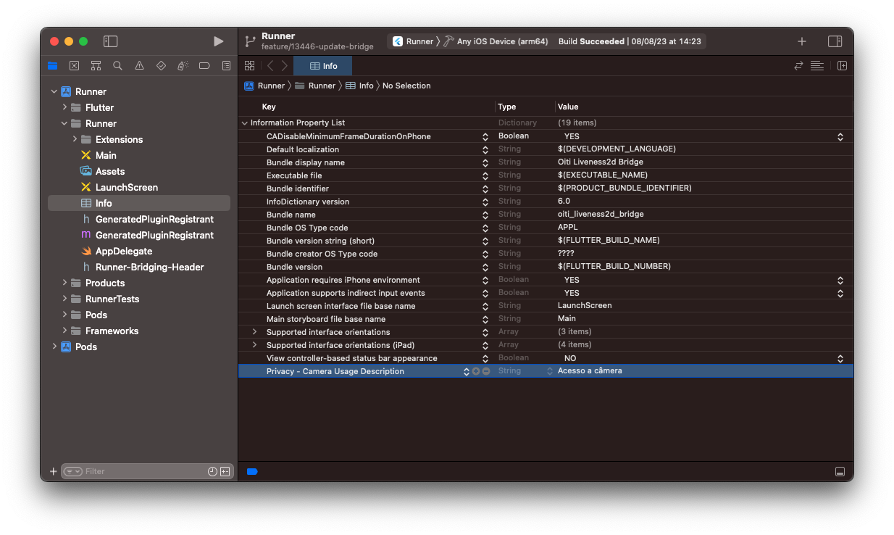

# Configuração Inicial no iOS

Para iniciar a configuracão inicial no iOS precisamos instalar o SDK do Liveness3D da Oititec, seguindo os seguintes passos:

## Passo 1: Criar Podfile

Acesse a pasta `ios` e execute o comando para criar o arquivo de Pods, caso já exista você pode pular esse passo.

```bash
pod init
```

## Passo 2: Repositório e Dependências

No arquivo `Podfile` na raiz da pasta iOS, adicione o endereço e o Pod do repositório da SDK iOS:

- [Acessar arquivo de exemplo](../../ios/Podfile).

```bash
  pod 'Flutter'
  pod 'FaceCaptcha', '5.1.0', :source => 'https://github.com/oititec/liveness-ios-specs'
```

## Passo 3: Instalar Dependências

Ainda na pasta `ios` Execute o comando de instalação dos Pods.

```bash
pod install
```

## Passo 4: Permissão para uso da câmera

O módulo FaceCaptcha, fazem uso da câmera, por isso é necessário caso explicitar o uso desse recurso no `Info.plist` do projeto.

- [Acessar arquivo de exemplo](../../ios/Runner/Info.plist).

```xml
<key>NSCameraUsageDescription</key>
<string>Acesso a câmera</string>
```

_Adição pelo Xcode_

Chave: `Privacy - Camera Usage Description`

<div style="align:center;">
  
</div>
