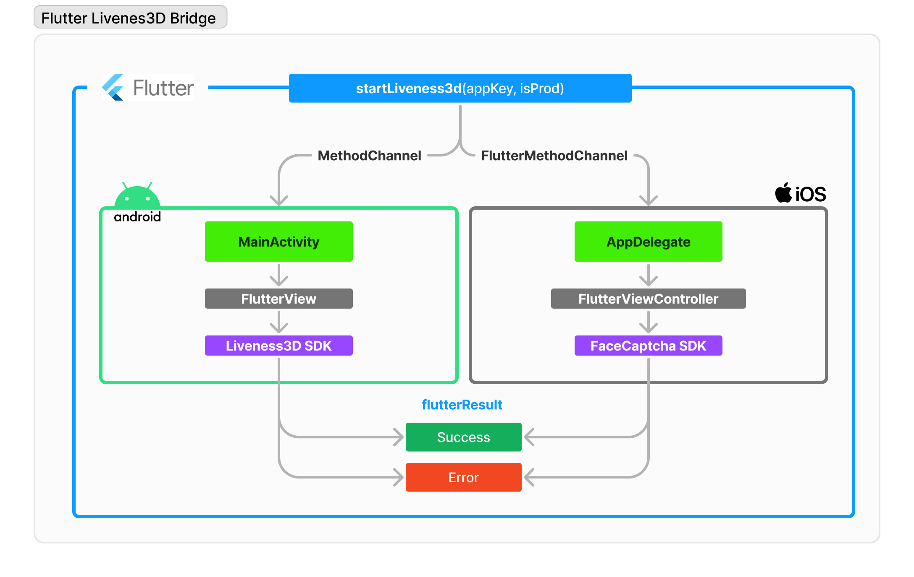

# Sobre este Repositório

Este repositório é responsável pela conexão do **Platform Channels do Flutter**, com ele é possível instalar e usar a SDK do Liveness3D da Oititec.

### Saiba mais sobre Liveness3D

- [Descrição e Resultados Liveness 3D](Documentation/Liveness3D.md)

## O que é Bridge?

A "bridge" no contexto do Flutter refere-se à infraestrutura subjacente que permite a comunicação entre o código Dart e o código nativo da plataforma, possibilitando a criação de aplicativos que podem acessar recursos e funcionalidades específicas de cada sistema operacional, além das capacidades oferecidas pelo próprio framework Flutter.

### Platform Channels:

Para realizar a comunicação entre o código Dart e o código nativo da plataforma, o Flutter usa o conceito de "platform channels" (canais de plataforma). Esses canais permitem que você envie mensagens de um lado para o outro da "ponte" entre o código Dart e o código nativo. Isso é útil quando você precisa acessar recursos ou funcionalidades específicas da plataforma que não estão diretamente disponíveis no Flutter.

### MethodChannel:

O Flutter fornece duas classes principais para facilitar a comunicação através dos canais de plataforma: MethodChannel e EventChannel. Nesse projeto utilizamos apenas do MethodChannel que permite que você invoque métodos do código nativo a partir do Dart e obtenha callback`s.

<p align="center">
 
</p>

## Sumário

As instruções de uso, integração, implementação e customização do **Liveness 3D** podem ser acessadas através do sumário abaixo:

**Flutter:**

- [Configuração do Platform Channels](Documentation/flutter/PlatformChannelConfig.md).
- [Tratamento de Responses/Callback](Documentation/flutter/Liveness3dResponses.md).

**Android**

- [Configuração Inicial no Android](Documentation/android/InitConfig.md);
- [Configuração do FlutterEngine e MethodChannel](Documentation/android/FlutterEngine.md);
- [Como configurar o Liveness3DUser()?](https://devcenter.certiface.io/docs/guia-de-uso-e-integracao-android);
- [Como fazer a estilização dos Liveness3DTextsKey()?](https://devcenter.certiface.io/docs/customizacao-telas-de-inicializacao-liveness3d-android);
- [Guia de customização do Liveness3DTheme](https://github.com/oititec/liveness-android-sdk/blob/main/Documentation/Liveness3D-Liveness3DTheme.md);
- [Guia de Implementação de View Customizada](https://devcenter.certiface.io/docs/customizacao-telas-de-inicializacao-liveness3d-android);
- [Como Enviar para o Flutter os Responses/Callback](Documentation/android/Callback.md);

**iOS:**

- [Configuração Inicial no iOS](Documentation/ios/InitConfig.md);
- [Configuração do FlutterEngine e MethodChannel](Documentation/ios/FlutterEngine.md);
- [Como configurar o Liveness3DUser()?](https://github.com/oititec/liveness-ios-sdk/blob/main/Documentation/Liveness3D/Liveness3D-Usage.md);
- [Como fazer a estilização dos Liveness3DTextsKey()?](https://github.com/oititec/liveness-ios-sdk/blob/main/Documentation/Liveness3D/Liveness3D-CustomTexts.md);
- [Guia de customização do Liveness3DTheme](https://github.com/oititec/liveness-ios-sdk/blob/main/Documentation/Liveness3D/Liveness3D-Liveness3DTheme.md);
- [Guia de Implementação de View Customizada](https://github.com/oititec/liveness-ios-sdk/blob/main/Documentation/Liveness3D/Liveness3D-CustomView.md);
- [Como Enviar para o Flutter Responses/Callback?](Documentation/ios/Callback.md);

### Como executar o clone do Repositório?

Execute o clone do repositório abaixo para baixar o código:

```sh
git clone https://github.com/oititec/flutter-liveness3d-bridge
```

### Como rodar o Script?

Para rodar o script desse repositório você deve instalar as dependências do projeto executando o seguinte comando no terminal;

#### Dependências

```sh
flutter pub get
```

### Como executar o projeto?

> Executar sempre em dispositivos físicos e não no simulador do iOS e Android pois nossa SDK tem emulator detection.

```sh
flutter run
```

Em seguida deve seguir escolher o dispositivo android ou iOS de debug listado no terminal.
